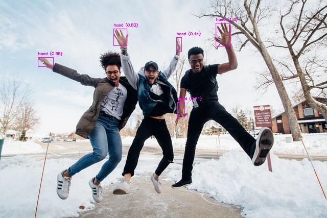
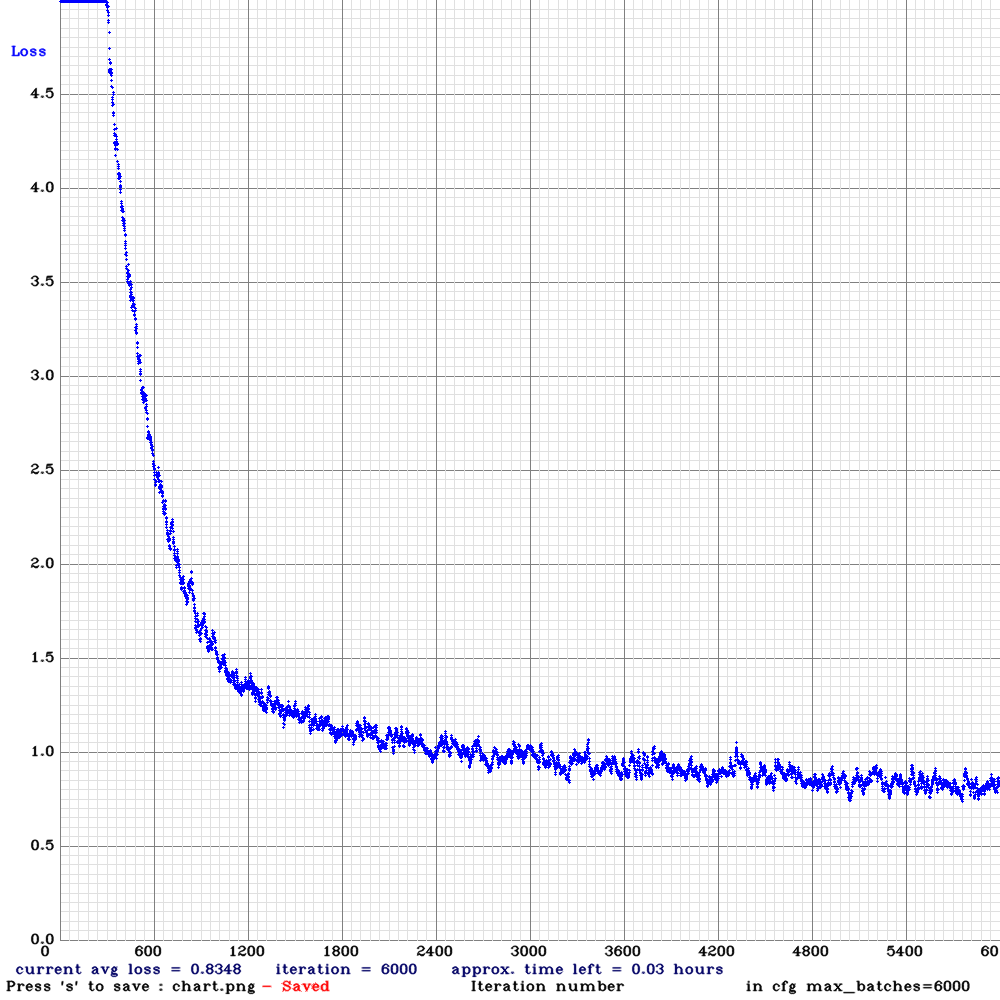
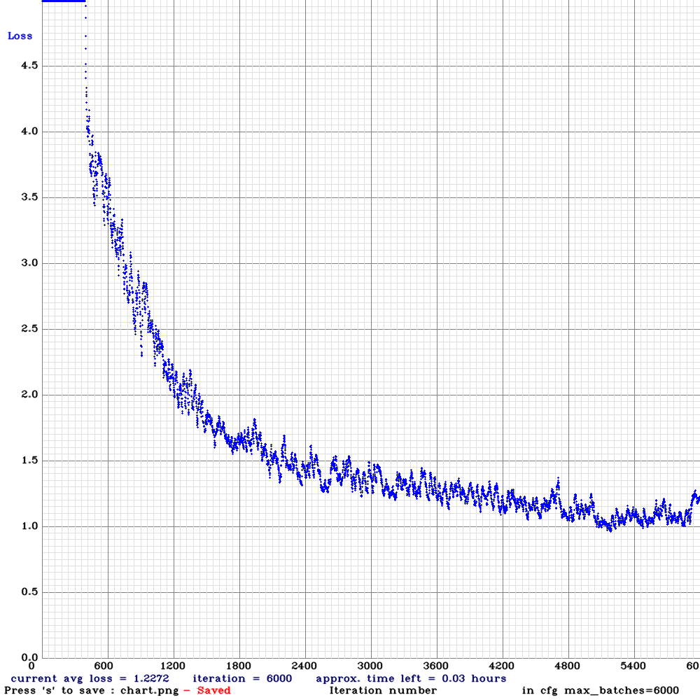
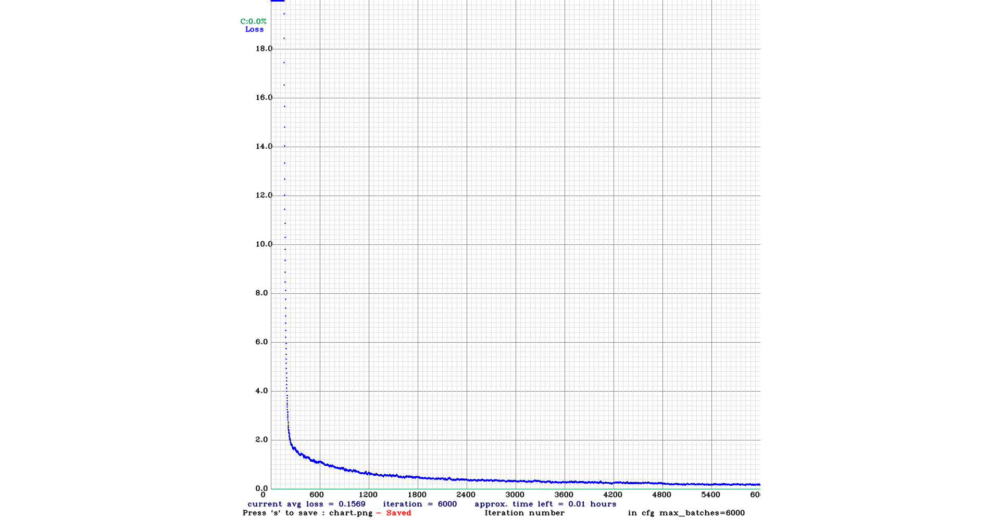

# YOLO-Hand-Detection
Scene hand detection for real world images.



### Idea
To detect hand gestures, we first have to detect the hand position in space. This pre-trained network is able to extract hands out of a `2D RGB` image, by using the YOLOv3 neural network.

There are already existing models available, mainly for MobileNetSSD networks. The goal of this model is to support a wider range of images and a more stable detector (hopefully 🙈).

### Dataset
The first version of this network has been trained on the [CMU Hand DB](http://domedb.perception.cs.cmu.edu/handdb.html) dataset, which is free to access and download. Because the results were ok, but not satisfying, I used it to pre annotate more images and manually then corrected the pre-annotations.

Because [Handtracking](https://github.com/victordibia/handtracking) by Victor Dibia is using the [Egohands](http://vision.soic.indiana.edu/projects/egohands/) dataset, I tried to include it into the training-set as well.

In the end, the training set consists of the CMU Hand DB, the Egohands dataset and my own trained images (mainly from marathon runners), called **cross-hands**.

### Training
The training took about 10 hours on a single NVIDIA 1080TI and was performed with the YOLOv3 default architecture. I also trained the slim version of it called YOLOv3-tiny.

#### YOLOv3


```
Precision: 0.89 Recall: 0.85 F1-Score: 0.87 IoU: 69.8
```

#### YOLOv3-Tiny



```
Precision: 0.76 Recall: 0.69 F1-Score: 0.72 IoU: 53.67
```

#### YOLOv3-Tiny-PRN
The tiny version of YOLO has been improved by the [partial residual networks paper](https://github.com/WongKinYiu/PartialResidualNetworks). Because of that I trained YOLO-Tiny-PRN and share the results here too. It is interesting to see that the Yolov3-Tiny-PRN performance **comes close** to the original Yolov3!



```
Precision: 0.89 Recall: 0.79 F1-Score: 0.83 IoU: 68.47
```

#### YOLOv4-Tiny
With the recent version of YOLOv4 it was interesting to see how good it performs against it's predecessor. Same precision, but better recall and IoU.



```
Precision: 0.89 Recall: 0.89 F1-Score: 0.89 IoU: 91.48
```

### Testing
I could not test the model on the same dataset as for example the Egohands dataset, because I mixed the training and testing samples together and created my own test-dataset out of it.

As soon as I have time, I will publish a comparison of my trained data vs. for example Handtracking.

### Inferencing
The models have been trained on an image size `416x416`. It is also possible to inference it with a lower model size to increase the speed. A good performance / accuracy mix on CPUs has been discovered by using an image size of `256x256`.

The model itself is fully compatible with the opencv dnn module and just ready to use.

### Demo
To run the demo, please first install all the dependencies ([requirements.txt](requirements.txt)) into a virtual environment and download the model and weights into the model folder (or run the shell script).

Then run the following command to start a webcam detector with YOLOv3:

```bash
# with python 3
python demo_webcam.py
```

Or this one to run a webcam detrector with YOLOv3 tiny:

```bash
# with python 3
python demo_webcam.py -n tiny
```

For YOLOv3-Tiny-PRN use the following command:

```bash
# with python 3
python demo_webcam.py -n prn
```

For YOLOv4-Tiny use the following command:

```bash
# with python 3
python demo_webcam.py -n v4-tiny
```

### Download

- YOLOv3 Cross-Dataset
	- [Configuration](https://github.com/cansik/yolo-hand-detection/releases/download/pretrained/cross-hands.cfg)
	- [Weights](https://github.com/cansik/yolo-hand-detection/releases/download/pretrained/cross-hands.weights)
- YOLOv3-tiny Cross-Hands
	- [Configuration](https://github.com/cansik/yolo-hand-detection/releases/download/pretrained/cross-hands-tiny.cfg)
	- [Weights](https://github.com/cansik/yolo-hand-detection/releases/download/pretrained/cross-hands-tiny.weights)
- YOLOv3-tiny-prn Cross-Hands
	- [Configuration](https://github.com/cansik/yolo-hand-detection/releases/download/pretrained/cross-hands-tiny-prn.cfg)
	- [Weights](https://github.com/cansik/yolo-hand-detection/releases/download/pretrained/cross-hands-tiny-prn.weights)
- YOLOv4-Tiny Cross-Hands
	- [Configuration](https://github.com/cansik/yolo-hand-detection/releases/download/pretrained/cross-hands-yolov4-tiny.cfg)
	- [Weights](https://github.com/cansik/yolo-hand-detection/releases/download/pretrained/cross-hands-yolov4-tiny.weights)

If you are interested in the CMU Hand DB results, please check the [release](https://github.com/cansik/yolo-hand-detection/releases/tag/pretrained) section.

### About
Trained by *[cansik](https://github.com/cansik)*, datasets are described in the readme and fall under the terms and conditions of their owners.

All the demo images have been downloaded from [unsplash.com](https://unsplash.com/):

Tim Marshall, Zachary Nelson, John Torcasio, Andy Falconer, Sherise, Alexis Brown
